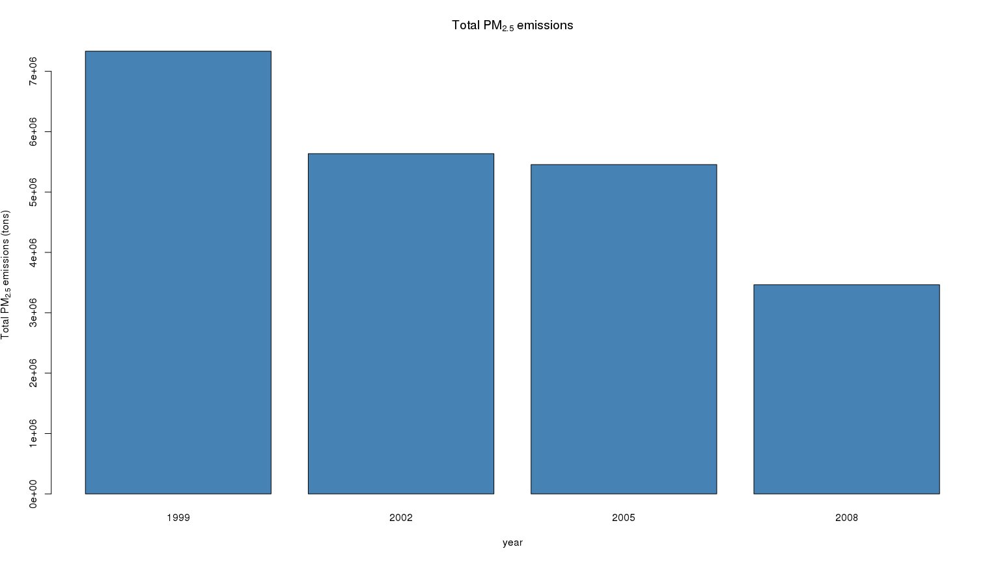
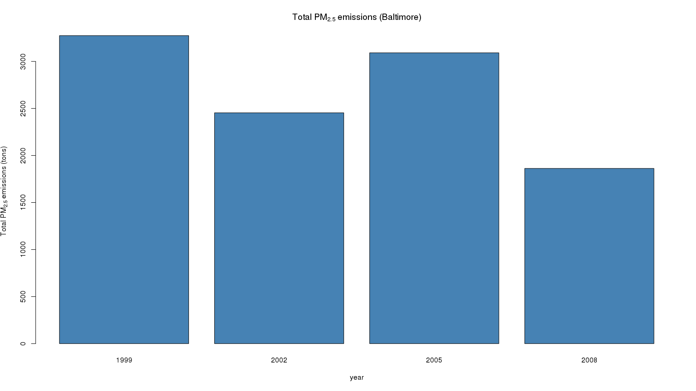
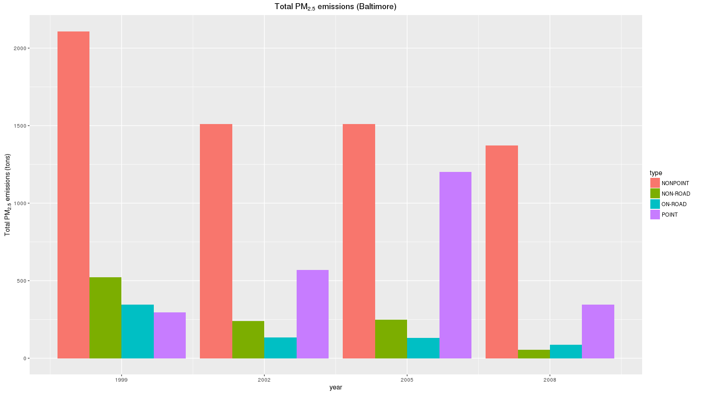
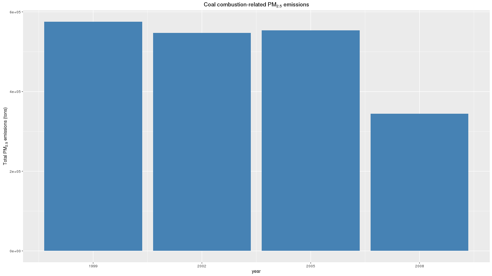
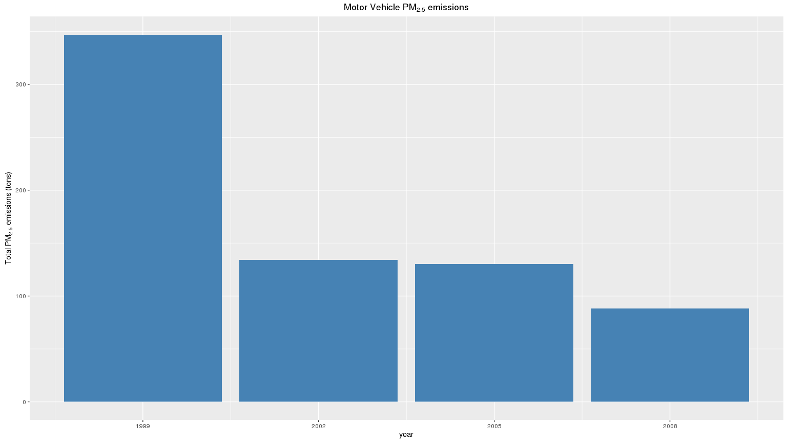
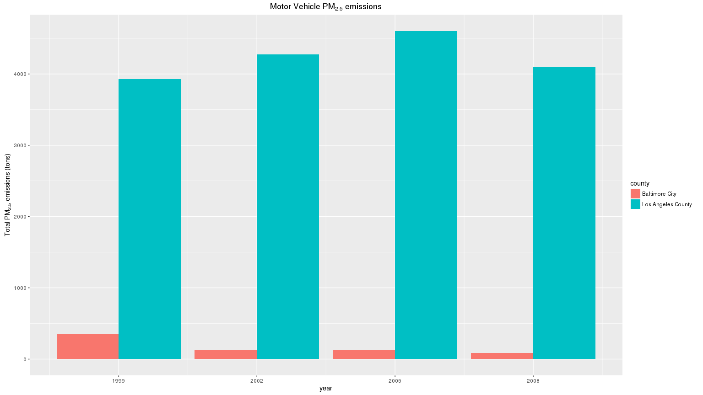

# PM25 summary by NEI
NighTurs  
December 26, 2015  

Libraries and constants

```r
library(data.table)
library(dplyr)
library(ggplot2)

baltimore_fips <- "24510"
los_angeles_fips <- "06037"
```

Reading datasets

```r
pm25 <- data.table(readRDS('data/summarySCC_PM25.rds'))
scc <- data.table(readRDS('data/Source_Classification_Code.rds'))
pm25 <- mutate(pm25, type = as.factor(type))
str(pm25)
```

```
## Classes 'data.table' and 'data.frame':	6497651 obs. of  6 variables:
##  $ fips     : chr  "09001" "09001" "09001" "09001" ...
##  $ SCC      : chr  "10100401" "10100404" "10100501" "10200401" ...
##  $ Pollutant: chr  "PM25-PRI" "PM25-PRI" "PM25-PRI" "PM25-PRI" ...
##  $ Emissions: num  15.714 234.178 0.128 2.036 0.388 ...
##  $ type     : Factor w/ 4 levels "NONPOINT","NON-ROAD",..: 4 4 4 4 4 4 4 4 4 4 ...
##  $ year     : int  1999 1999 1999 1999 1999 1999 1999 1999 1999 1999 ...
##  - attr(*, ".internal.selfref")=<externalptr>
```

Have total emissions from PM2.5 decreased in the United States from 1999 to 2008?

```r
year_summary <- pm25 %>% group_by(year) %>% 
    summarise(total_emissions = sum(Emissions)) %>% arrange(year)
with(year_summary, barplot(total_emissions, 
                           names.arg = year, 
                           col = 'steelblue',
                           main = expression('Total PM'[2.5]*' emissions'),
                           xlab = 'year',
                           ylab = expression('Total PM'[2.5]*
                                                 ' emissions (tons)')))
```

 

Have total emissions from PM2.5 decreased in the Baltimore City, Maryland

```r
year_summary <- pm25 %>% filter(fips == baltimore_fips) %>% group_by(year) %>% 
    summarise(total_emissions = sum(Emissions)) %>% arrange(year)
with(year_summary, barplot(total_emissions, 
                           names.arg = year, 
                           col = 'steelblue',
                           main = expression('Total PM'[2.5]*' emissions '*
                                                 '(Baltimore)'),
                           xlab = 'year',
                           ylab = expression('Total PM'[2.5]*
                                                 ' emissions (tons)')))
```

 

Of the four types of sources indicated by the type (point, nonpoint, onroad, nonroad) variable, which of these four sources have seen decreases in emissions from 1999–2008 for Baltimore City?

```r
year_type_summary <- pm25 %>% filter(fips == baltimore_fips) %>% 
    group_by(year, type) %>% 
    summarise(total_emissions = sum(Emissions))
ggplot(year_type_summary, aes(year, total_emissions, fill = type)) + 
    geom_bar(stat = 'identity', position = 'dodge') + 
    scale_x_continuous(breaks = unique(year_type_summary$year)) +
    labs(x = 'year', y = expression('Total PM'[2.5]*' emissions (tons)'),
         title = expression('Total PM'[2.5]*' emissions (Baltimore)'))
```

 

Across the United States, how have emissions from coal combustion-related sources changed from 1999–2008?

```r
coal_scc <- scc[grep('.*[Cc]omb.*[Cc]oal.*', scc$Short.Name), SCC]
coal_year_summary <- pm25 %>% filter(SCC %in% coal_scc) %>% 
    group_by(year) %>% 
    summarise(total_emissions = sum(Emissions))
ggplot(coal_year_summary, aes(year, total_emissions)) + 
    geom_bar(stat = 'identity', fill = 'steelblue') + 
    scale_x_continuous(breaks = unique(year_type_summary$year)) +
    labs(x = 'year', y = expression('Total PM'[2.5]*' emissions (tons)'),
         title = expression('Coal combustion-related PM'[2.5]* ' emissions'))
```

 

How have emissions from motor vehicle sources changed from 1999–2008 in Baltimore City?

```r
highway_vehicle_scc <- scc[grep('.*Highway Veh.*', scc$Short.Name), SCC]
year_vehicle_summary <- pm25 %>% 
    filter(fips == baltimore_fips & SCC %in% highway_vehicle_scc) %>% 
    group_by(year) %>% 
    summarise(total_emissions = sum(Emissions))
ggplot(year_vehicle_summary, aes(year, total_emissions)) + 
    geom_bar(stat = 'identity', fill = 'steelblue') + 
    scale_x_continuous(breaks = unique(year_vehicle_summary$year)) +
    labs(x = 'year', y = expression('Total PM'[2.5]*' emissions (tons)'),
         title = expression('Motor Vehicle PM'[2.5]* ' emissions'))
```

 

Compare emissions from motor vehicle sources in Baltimore City with emissions from motor vehicle sources in Los Angeles County, California. Which city has seen greater changes over time in motor vehicle emissions?

```r
year_vehicle_summary <- pm25 %>% 
    filter(fips %in% c(baltimore_fips, los_angeles_fips) & 
               SCC %in% highway_vehicle_scc) %>% 
    group_by(year, fips) %>% 
    summarise(total_emissions = sum(Emissions)) %>%
    mutate(county = ifelse(fips == baltimore_fips, 'Baltimore City', 
                           'Los Angeles County'))
ggplot(year_vehicle_summary, aes(year, total_emissions, fill = county)) + 
    geom_bar(stat = 'identity', position = 'dodge') + 
    scale_x_continuous(breaks = unique(year_vehicle_summary$year)) +
    labs(x = 'year', y = expression('Total PM'[2.5]*' emissions (tons)'),
         title = expression('Motor Vehicle PM'[2.5]* ' emissions'))
```

 


